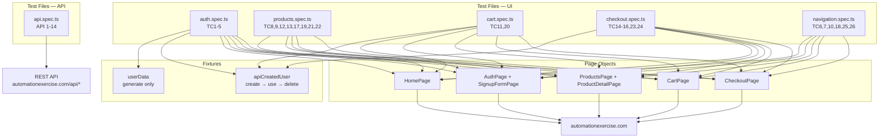
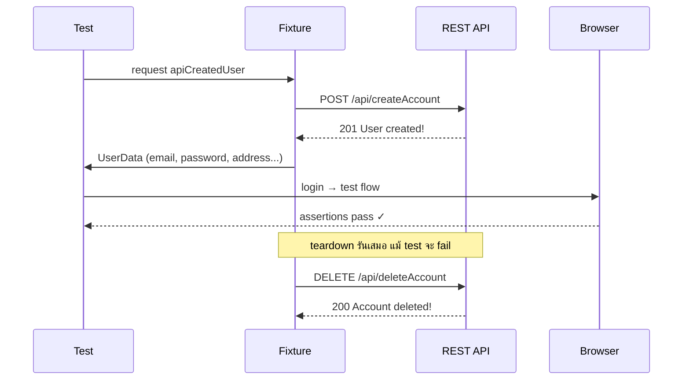

# Playwright E2E + API Test Suite — Automation Exercise

[](https://playwright.dev)
[](https://www.typescriptlang.org)
[]()
[]()
[]()
[]()

---

**Tech stack:** Playwright · TypeScript · Page Object Model · Custom Fixtures · GitHub Actions

**Target:** [https://automationexercise.com](https://automationexercise.com) — full-featured e-commerce demo สร้างมาเพื่อฝึก automation โดยเฉพาะ มี user registration, cart, checkout, และ REST API


---

## วิเคราะห์ site ก่อนเขียน test

### Map หน้าทั้งหมด

```
/                        — Home (hero, recommended items, subscription footer)
/login                   — Auth (login + signup step 1 รวมหน้าเดียว)
/signup                  — Signup form เต็ม (step 2)
/products                — All products + search + brand/category sidebar
/product_details/:id     — Product detail + review form
/view_cart               — Cart
/checkout                — Address review + order summary + comment
/payment                 — Payment form
/payment_done            — Order success + download invoice
/contact_us              — Contact form (file upload + browser dialog)
/test_cases              — Test cases page
/category_products/:id   — Category product listing
/brand_products/:brand   — Brand product listing
```

### สิ่งที่เจอระหว่าง explore ที่สำคัญ

**1. สองฟอร์มในหน้าเดียว** — `/login` มีทั้ง Login (ซ้าย) และ New User Signup (ขวา) ถ้าเขียน locator ไม่ระวัง อาจ grab ผิดฟอร์ม แก้โดยใช้ `data-qa` attribute ที่ต่างกัน

**2. Signup มี 2 steps** — step 1 กรอกแค่ชื่อ + email → step 2 ถึงจะมีฟอร์มเต็ม (DOB, address, ฯลฯ) ต้องแยก page object ออกเป็นสองตัว `AuthPage` และ `SignupFormPage`

**3. ทุก interactive element มี `data-qa` attribute** — สัญญาณว่า developer สร้าง selector ไว้สำหรับ automation โดยตั้งใจ

**4. Subscription input มีตัวสะกดผิดบน site จริง** — `id="susbscribe_email"` (ไม่ใช่ subscribe) ถ้าไม่สังเกตจะ locator ไม่เจอ

**5. Contact Us form ใช้ browser `alert` dialog** — กด Submit แล้วมี native alert ขึ้น ต้องลงทะเบียน `dialog` event handler ก่อน click ไม่ใช่หลัง

**6. Add to cart มีสอง path** — จาก hover overlay (หน้า All Products) และจากหน้า Product Detail โดยตรง แต่ละ path มี behavior ต่างกัน

**7. Checkout มี "login gate"** — ถ้า guest กด Proceed To Checkout จะมี modal ขึ้นให้ login/register ก่อน ต้องจัดการ flow นี้แยกจาก checkout ปกติ

**8. REST API ส่ง `responseCode` ใน body ไม่ใช่ HTTP status** — `res.status()` เป็น 200 เสมอ แต่ `json.responseCode` คือ code จริง เช่น 201, 400, 405 ต้องเทสทั้งสองชั้น

---

## วางแผน test strategy

### Risk-based prioritization

```
สูงมาก    Auth (register, login, logout)       — ถ้าพัง ทุกอย่างพัง
สูงมาก    Checkout (full order flow)           — revenue path
สูง       Cart (add, remove, quantity)         — core user journey
สูง       API (product, user, search)          — backend contract
กลาง      Products (search, browse, review)    — discovery
กลาง      Navigation (category, brand, scroll) — usability
ต่ำ       Subscription, Test Cases page        — nice-to-have
```

### API-first vs UI setup

การตัดสินใจสำคัญที่สุดในโปรเจคนี้คือ **ใช้ API สร้าง test user แทนที่จะ signup ผ่าน UI ทุกครั้ง**

Signup ผ่าน UI ใช้เวลา ~8-12 วินาที เพราะต้องกรอก 15+ fields
สร้างผ่าน API ใช้เวลา ~0.5 วินาที

สำหรับ test ที่ต้องการ "user ที่มีอยู่แล้ว" แต่ไม่ได้เทส signup flow เช่น TC2 (Login), TC4 (Logout), TC16 (Login before Checkout) — ใช้ `apiCreatedUser` fixture แทน

สำหรับ test ที่เทส signup flow จริงๆ เช่น TC1, TC14, TC15, TC23, TC24 — ต้องทำ UI signup เพราะนั่นคือสิ่งที่เทส

### สิ่งที่ตัดออกโดยตั้งใจ

- Visual regression — นอก scope
- Performance testing — ต้องใช้ k6 หรือ Artillery ไม่ใช่ Playwright
- Email verification flow — ต้องมี mailbox จริง ซับซ้อนเกินโปรเจคนี้
- Negative checkout (payment fail) — site ไม่ได้ simulate payment error

---

## Architecture



### apiCreatedUser Fixture Flow



---

## Architecture decisions

### โครงสร้างโปรเจค

```
automationexercise/
├── data/
│   └── user.ts              ← data factory + payment constants
├── fixtures/
│   ├── index.ts             ← custom Playwright fixtures
│   └── sample-upload.txt    ← ไฟล์สำหรับ TC6 file upload
├── pages/
│   ├── HomePage.ts          ← navbar + subscription + scroll
│   ├── AuthPage.ts          ← login form + signup step 1
│   ├── SignupFormPage.ts     ← signup form เต็ม + account created/deleted
│   ├── ProductsPage.ts      ← all products + search + hover + brand/category
│   ├── ProductDetailPage.ts ← product info + quantity + add to cart + review
│   ├── CartPage.ts          ← cart items + remove + proceed + subscription
│   └── CheckoutPage.ts      ← checkout review + payment + success + download
└── tests/
    ├── auth.spec.ts          ← TC1-5
    ├── products.spec.ts      ← TC8,9,12,13,17,19,21,22
    ├── cart.spec.ts          ← TC11,20
    ├── checkout.spec.ts      ← TC14-16,23,24
    ├── navigation.spec.ts    ← TC6,7,10,18,25,26
    └── api.spec.ts           ← API 1-14 (ไม่เปิด browser)
```

### Custom Fixtures — หัวใจของโปรเจคนี้

Playwright fixture คือ mechanism เดียวกับ dependency injection — test ประกาศว่าต้องการอะไร fixture จัดหาให้และ cleanup หลัง test จบ

```ts
// fixtures/index.ts
export const test = base.extend<CustomFixtures>({
  apiCreatedUser: async ({ request }, use) => {
    const user = generateUser();

    // setup: สร้าง user ผ่าน API
    await request.post('/api/createAccount', { form: { ...user } });

    await use(user); // ← test รันตรงนี้

    // teardown: ลบ user ผ่าน API (รันเสมอแม้ test จะ fail)
    await request.delete('/api/deleteAccount', {
      form: { email: user.email, password: user.password },
    });
  },
});
```

ข้อดีที่ทำให้นี่คือ senior pattern:

- **Setup + teardown อยู่ที่เดียว** — ไม่มี `beforeEach` + `afterEach` แยกที่ลืมเชื่อมกัน
- **Teardown รันเสมอ** — แม้ test จะ fail ตรงกลาง user ก็จะถูกลบ ไม่มี orphaned data
- **Type-safe** — TypeScript รู้ว่า `apiCreatedUser` มี field อะไรบ้าง
- **Reusable** — ทุก test ที่ต้องการ user สำเร็จรูปแค่ declare fixture ชื่อนั้น

### Data Factory

```ts
// data/user.ts
export function generateUser(): UserData {
  return {
    email: `pw_tester_${Date.now()}@mailtest.dev`, // timestamp ทำให้ unique
    // ... ข้อมูลอื่นคงที่เพราะ predictable
  };
}
```

ใช้ timestamp แทน random string เพราะ:
- Unique ทุก millisecond — ไม่มีทางชนกัน
- Debug ง่ายกว่า — เรียง timestamp รู้ว่า test ไหนสร้าง user ไหน
- ไม่ต้อง install faker library เพิ่ม

### `test.step()` สำหรับ complex flows

Checkout test ยาวมาก (15-20 ขั้นตอน) ถ้าเขียนติดกันไม่มี structure เวลา fail ไม่รู้ว่า fail ตรงไหน

```ts
test('TC14: Place Order: Register while Checkout', async ({ page, userData }) => {
  await test.step('Add product to cart as guest', async () => { ... });
  await test.step('Navigate to checkout - hit login gate', async () => { ... });
  await test.step('Register new account', async () => { ... });
  await test.step('Return to cart and proceed to checkout', async () => { ... });
  await test.step('Place order and pay', async () => { ... });
  await test.step('Delete account', async () => { ... });
});
```

HTML report จะแสดงแต่ละ step พร้อม timing และ screenshot ตรงจุดที่ fail ทำให้ debug ได้เลยโดยไม่ต้องรัน test ซ้ำ

### Page Object แบบ Single Responsibility

แต่ละ page object รับผิดชอบแค่หน้าของตัวเอง ไม่รู้จักหน้าอื่น:

```ts
// CartPage รู้แค่เรื่อง cart
async proceedToCheckout() {
  await this.proceedToCheckoutBtn.click();
}

// CartPage ไม่รู้ว่าหลังกด checkout แล้วจะไปไหน — test ต่างหากที่รู้
```

ข้อยกเว้น: `CheckoutPage` ครอบ 3 URL (`/checkout`, `/payment`, `/payment_done`) เพราะทั้งสามเป็น linear flow ของ checkout เดียวกัน การแยกออกเป็น 3 class จะทำให้ test code ซับซ้อนขึ้นโดยไม่ได้ประโยชน์

---

## Test Coverage ละเอียด

### `auth.spec.ts` — 5 tests

| Test | TC | ประเภท | Fixture | เหตุผล |
|---|---|---|---|---|
| Register User full flow | TC1 | End-to-end | `userData` | ต้องเทส signup ตั้งแต่ต้น — ไม่ใช้ API setup |
| Login with correct credentials | TC2 | Happy path | `apiCreatedUser` | ไม่ได้เทส signup — ใช้ API เร็วกว่า 10x |
| Login with incorrect credentials | TC3 | Negative | ไม่มี | ไม่ต้องมี user จริง |
| Logout | TC4 | Functional | `apiCreatedUser` | เทส logout ไม่ใช่ signup |
| Register with existing email | TC5 | Edge case | `apiCreatedUser` | ใช้ email ของ apiCreatedUser เป็น "email ที่มีอยู่แล้ว" |

TC5 เป็นตัวอย่างที่ดีของการใช้ fixture อย่างชาญฉลาด — `apiCreatedUser` สร้าง user ไว้ให้ แล้ว test พยายาม signup ด้วย email เดียวกัน เพื่อเทส error message "Email Address already exist!"

### `products.spec.ts` — 8 tests

| Test | TC | สิ่งที่โชว์ |
|---|---|---|
| All Products + detail | TC8 | Basic navigation, field presence |
| Search Product | TC9 | Search input, result validation |
| Add via hover | TC12 | CSS hover state, overlay interaction, modal dismiss |
| Product quantity | TC13 | Input manipulation, cart quantity verify |
| Remove from cart | TC17 | Cart mutation, empty state |
| Brand products | TC19 | Sidebar navigation, URL change, product listing |
| Add review | TC21 | Form submission, success assertion |
| Recommended items | TC22 | Scroll, carousel interaction |

TC12 (hover) เป็น test ที่ซับซ้อนที่สุดในกลุ่มนี้ เพราะต้อง hover เพื่อ reveal overlay ก่อน แล้วค่อยคลิก button ที่ซ่อนอยู่ ถ้า hover ช้าเกินไป overlay จะ fade out ก่อน Playwright จัดการให้โดย auto-wait

### `cart.spec.ts` — 2 tests

| Test | TC | สิ่งที่โชว์ |
|---|---|---|
| Subscription in Cart page | TC11 | Scroll + subscription form ใน footer ของหน้า cart |
| Search → Add → Login → Verify cart | TC20 | Cart persistence ข้ามสถานะ guest → logged in |

TC20 เป็น test ที่ซับซ้อนเพราะเทส behavior ที่ละเอียดอ่อน — cart ของ guest session ต้องยังอยู่หลัง login หลาย site ทำตรงนี้ผิดและ cart หายไป

### `checkout.spec.ts` — 5 tests

| Test | TC | ความซับซ้อน | เหตุผล |
|---|---|---|---|
| Register while Checkout | TC14 | สูงมาก | Guest → hit login gate → register mid-flow → ซื้อ |
| Register before Checkout | TC15 | สูง | Register → shop → checkout |
| Login before Checkout | TC16 | กลาง | `apiCreatedUser` + full checkout |
| Verify address in checkout | TC23 | กลาง | ข้อมูล address ต้องตรงกับที่ลงทะเบียน |
| Download Invoice | TC24 | สูง | Full flow + `waitForEvent('download')` |

TC14 และ TC15 ซ้อนกันแต่เทสคนละ scenario:
- TC14: user เริ่มซื้อก่อน แล้วค่อย register ตอน checkout
- TC15: user register ก่อน แล้วค่อยซื้อ

สอง path นี้ผ่านโค้ดคนละสาย ต้องเทสแยกกัน

**TC24 — Download:**
```ts
const [download] = await Promise.all([
  this.page.waitForEvent('download'), // รอ event ก่อน
  this.downloadInvoiceBtn.click(),    // แล้วค่อย trigger
]);
const filePath = await download.path();
expect(filePath).toBeTruthy(); // ไฟล์ต้องมีจริงบน disk
```

`Promise.all` จำเป็น — ถ้า `click()` ก่อนแล้วค่อย `waitForEvent` อาจพลาด event ที่เกิดขึ้นแล้ว

### `navigation.spec.ts` — 6 tests

| Test | TC | Interaction พิเศษ |
|---|---|---|
| Contact Us Form | TC6 | File upload + browser `alert` dialog intercept |
| Test Cases Page | TC7 | Simple navigation |
| Subscription home | TC10 | Scroll + email subscribe |
| Category Products | TC18 | Sidebar accordion + sub-category |
| Scroll Up (arrow) | TC25 | `scrollTo(0, bottom)` → click arrow → `toBeInViewport()` |
| Scroll Up (manual) | TC26 | `scrollTo(0, bottom)` → `scrollTo(0, 0)` → verify |

**TC6 — Dialog intercept:**
```ts
// ต้องลงทะเบียน handler ก่อน click เสมอ
// ถ้าลงทะเบียนหลัง click อาจพลาด dialog ที่ขึ้นเร็วมาก
page.once('dialog', dialog => dialog.accept());
await page.locator('input[data-qa="submit-button"]').click();
```

ใช้ `page.once` (ไม่ใช่ `page.on`) เพราะต้องการ handle แค่ dialog นี้ครั้งเดียว ถ้าใช้ `page.on` จะ auto-accept ทุก dialog ตลอด test ซึ่งอาจซ่อน bug

**TC25 vs TC26:**

TC25 และ TC26 เทสพฤติกรรมเดียวกัน (กลับขึ้นด้านบน) แต่คนละวิธี
- TC25: ใช้ปุ่ม arrow button ที่ corner — เทส UI element
- TC26: ใช้ keyboard/scroll manual — เทส browser scroll behavior

ทั้งสองต้องผ่านเพราะเป็น requirement แยกกัน

### `api.spec.ts` — 14 tests (ไม่เปิด browser)

```ts
// ใช้ request fixture โดยตรง — เร็วกว่า UI test มาก
test('API 1: GET productsList', async ({ request }) => {
  const res = await request.get('/api/productsList');
  expect(res.status()).toBe(200);          // HTTP layer
  const json = await res.json();
  expect(json.responseCode).toBe(200);    // application layer
  expect(Array.isArray(json.products)).toBe(true);
  expect(json.products[0]).toHaveProperty('id');   // schema validation
  expect(json.products[0]).toHaveProperty('name');
});
```

ทุก API test เทส 3 ชั้น:
1. **HTTP status** — connection ถึงหรือเปล่า
2. **responseCode** — application logic ถูกหรือเปล่า
3. **Response schema** — structure ของ data ถูกต้องหรือเปล่า

| API | Method | ทำอะไร |
|---|---|---|
| 1 | GET | Products list |
| 2 | POST | Method not allowed (405) |
| 3 | GET | Brands list |
| 4 | PUT | Method not allowed (405) |
| 5 | POST | Search product with keyword |
| 6 | POST | Search without parameter → 400 |
| 7 | POST | Verify login valid → 200 |
| 8 | POST | Verify login missing email → 400 |
| 9 | DELETE | Method not allowed (405) |
| 10 | POST | Verify login invalid → 404 |
| 11 | POST | Create account → 201 |
| 12 | DELETE | Delete account → 200 |
| 13 | PUT | Update account → 200 |
| 14 | GET | Get user by email → 200 |

API 7, 11, 12, 13, 14 ต้องมี user จริง — แต่ละ test สร้างและลบ user ของตัวเองภายใน test นั้น ไม่ได้ใช้ fixture เพราะ test เหล่านี้ใช้ `@playwright/test` base ตรงๆ ไม่ได้ extend fixture ของเรา

---

## Senior Techniques สรุป

| Technique | ใช้ที่ไหน | ทำไม |
|---|---|---|
| **Custom Playwright fixture** | `fixtures/index.ts` — `apiCreatedUser` | Setup + teardown ในที่เดียว, type-safe, auto-cleanup |
| **API-first user creation** | TC2, TC4, TC5, TC16, TC20 | เร็วกว่า UI signup 10-20x |
| **`test.step()`** | checkout.spec.ts ทุก test | HTML report แสดง step-level timing และ screenshot |
| **Browser dialog intercept** | TC6 — Contact Us | `page.once('dialog')` ก่อน click |
| **File upload** | TC6 — Contact Us | `setInputFiles()` |
| **Hover interaction** | TC12 — Add via hover | `hover()` เพื่อ reveal CSS overlay |
| **Download event** | TC24 — Invoice | `waitForEvent('download')` ใน `Promise.all` |
| **Scroll + viewport assert** | TC25, TC26 | `scrollTo` + `toBeInViewport()` |
| **API testing (no browser)** | api.spec.ts ทั้งหมด | `request` fixture — เร็ว, isolated |
| **Data factory** | `data/user.ts` | Timestamp-unique emails, zero dependencies |
| **Parallel-safe isolation** | ทุก test | แต่ละ test มี browser context ของตัวเอง |

---

## Multi-browser Configuration

```ts
projects: [
  { name: 'chromium', use: { ...devices['Desktop Chrome'] } },
  { name: 'firefox',  use: { ...devices['Desktop Firefox'] } },
]
```

ใช้แค่ 2 browser (ต่างจาก saucedemo ที่ใช้ 5) เพราะ test suite นี้ซับซ้อนกว่ามาก และบาง test ต้องสร้าง/ลบ user จริงบน live site ถ้าใช้ 5 browser × 40 tests = 200 API calls ต่อ run อาจโดน rate limit

---

## CI/CD

```yaml
# .github/workflows/playwright.yml
defaults:
  run:
    working-directory: automationexercise  # รันจาก subfolder
```

Key decisions:
- `retries: 1` บน CI (ต่ำกว่า saucedemo เพราะ test นี้ซับซ้อนกว่า — retry ซ่อนปัญหาได้ง่ายกว่า)
- `workers: 2` บน CI — parallel แต่ระวัง rate limit ของ live site
- HTML report เป็น artifact 30 วัน

---

## วิธีรัน

```bash
# ติดตั้ง dependencies
npm install

# ติดตั้ง browsers
npx playwright install

# รันทุก test
npm test

# รัน browser เดียว
npm run test:chromium

# รันแค่ API tests (ไม่เปิด browser)
npm run test:api

# UI mode — debug แบบ interactive
npm run test:ui

# ดู HTML report
npm run report
```

---

## Results

```
40 UI tests  | 5 spec files | Chromium + Firefox
14 API tests | 1 spec file  | No browser
─────────────────────────────────────────────────
54 total tests
Browsers: Chromium, Firefox
```

---

---

# Playwright E2E + API Test Suite — Automation Exercise (English)

**Tech stack:** Playwright · TypeScript · Page Object Model · Custom Fixtures · GitHub Actions

**Target:** [https://automationexercise.com](https://automationexercise.com) — a full-featured e-commerce demo with user registration, cart, checkout, and REST API

---

## Why Automation Exercise?

Compared to Sauce Demo (previous project):

| | Sauce Demo | Automation Exercise |
|---|---|---|
| Registration flow | None | Full (title, DOB, address, newsletter) |
| Checkout | Yes | Yes + payment + download invoice |
| REST API | None | 14 endpoints |
| File upload | None | Yes (Contact Us) |
| Category / Brand | None | Yes (sidebar navigation) |
| Scroll behavior | None | Yes (scroll-up arrow) |

Chosen because it covers significantly more complex interactions and has a REST API to test separately — demonstrating both UI and API skills.

---

## Site Analysis (Before Writing a Single Test)

### Full page map

```
/                        — Home (hero, recommended items, subscription footer)
/login                   — Auth (login + signup step 1 combined)
/signup                  — Full signup form (step 2)
/products                — All products + search + brand/category sidebar
/product_details/:id     — Product detail + review form
/view_cart               — Cart
/checkout                — Address review + order summary + comment
/payment                 — Payment form
/payment_done            — Order success + download invoice
/contact_us              — Contact form (file upload + browser dialog)
/test_cases              — Test cases page
/category_products/:id   — Category product listing
/brand_products/:brand   — Brand product listing
```

### Key findings during manual exploration

**1. Two forms on one page** — `/login` has both Login (left) and New User Signup (right). Careless locators would grab the wrong form. Fixed by using distinct `data-qa` attributes on each form.

**2. Signup has 2 steps** — Step 1 is just name + email. Step 2 is the full form (DOB, address, etc). Required splitting into two page objects: `AuthPage` and `SignupFormPage`.

**3. All interactive elements have `data-qa` attributes** — developer intentionally added these for automation.

**4. Subscription input has a typo on the real site** — `id="susbscribe_email"` (not "subscribe"). Missed this → locator finds nothing.

**5. Contact Us uses a native browser `alert` dialog** — must register the `dialog` event handler BEFORE clicking Submit. Registering after may miss the event.

**6. Add to cart has two paths** — from hover overlay (All Products page) and from Product Detail directly. Each path has different behavior.

**7. Checkout has a "login gate"** — guests who click Proceed To Checkout see a modal requiring login/register first. This flow is separate from a normal logged-in checkout.

**8. REST API returns `responseCode` in body, not HTTP status** — `res.status()` is always 200, but `json.responseCode` holds the real code (201, 400, 405, etc.). Both layers must be tested.

---

## Test Strategy

### Risk-based prioritization

```
CRITICAL    Auth (register, login, logout)       — everything else depends on this
CRITICAL    Checkout (full order flow)           — revenue path
HIGH        Cart (add, remove, quantity)         — core user journey
HIGH        API (product, user, search)          — backend contract
MEDIUM      Products (search, browse, review)    — discovery
MEDIUM      Navigation (category, brand, scroll) — usability
LOW         Subscription, Test Cases page        — nice-to-have
```

### API-first vs UI setup

The most important decision in this project: **use the API to create test users instead of UI signup every time**.

UI signup takes ~8-12 seconds (15+ form fields to fill).
API creation takes ~0.5 seconds.

Tests that need "an existing user" but don't test signup itself — TC2, TC4, TC16, TC20 — use the `apiCreatedUser` fixture.

Tests that actually test signup — TC1, TC14, TC15, TC23, TC24 — must do UI signup because that's what's being tested.

### Deliberately excluded

- Visual regression — out of scope
- Performance testing — requires k6 or Artillery, not Playwright
- Email verification flow — requires a real mailbox
- Payment failure scenarios — site doesn't simulate payment errors

---

## Architecture Decisions

### Custom Fixtures — the core of this project

A Playwright fixture is the same concept as dependency injection — the test declares what it needs, the fixture provides it and handles cleanup.

```ts
export const test = base.extend<CustomFixtures>({
  apiCreatedUser: async ({ request }, use) => {
    const user = generateUser();

    // setup: create user via API
    await request.post('/api/createAccount', { form: { ...user } });

    await use(user); // ← test runs here

    // teardown: delete user (always runs, even if test fails)
    await request.delete('/api/deleteAccount', {
      form: { email: user.email, password: user.password },
    });
  },
});
```

Why this is senior-level:
- **Setup + teardown in one place** — no disconnected `beforeEach` + `afterEach`
- **Teardown always runs** — even if the test fails midway, no orphaned data
- **Type-safe** — TypeScript knows exactly what fields `apiCreatedUser` has
- **Reusable** — any test that needs a ready-made user just declares the fixture

### `test.step()` for complex flows

Checkout tests are 15-20 steps long. Without structure, failures are hard to locate.

```ts
test('TC14: Place Order: Register while Checkout', async ({ page, userData }) => {
  await test.step('Add product to cart as guest', async () => { ... });
  await test.step('Navigate to checkout - hit login gate', async () => { ... });
  await test.step('Register new account', async () => { ... });
  await test.step('Return to cart and proceed to checkout', async () => { ... });
  await test.step('Place order and pay', async () => { ... });
  await test.step('Delete account', async () => { ... });
});
```

HTML report shows each step with timing and screenshot at the exact point of failure — no need to re-run the test to debug.

### Download handling

```ts
// Promise.all is mandatory — if click() runs first, the download event may already be gone
const [download] = await Promise.all([
  this.page.waitForEvent('download'),
  this.downloadInvoiceBtn.click(),
]);
const filePath = await download.path();
expect(filePath).toBeTruthy();
```

### Dialog interception

```ts
// Register handler BEFORE the click that triggers it
// page.once (not page.on) — handles only this dialog, not all future dialogs
page.once('dialog', dialog => dialog.accept());
await page.locator('input[data-qa="submit-button"]').click();
```

---

## How to Run

```bash
npm install
npx playwright install

npm test                  # all tests, all browsers
npm run test:chromium     # single browser
npm run test:api          # API tests only (no browser)
npm run test:ui           # interactive UI mode
npm run report            # open HTML report
```

---

## Results

```
40 UI tests  | 5 spec files | Chromium + Firefox
14 API tests | 1 spec file  | No browser required
─────────────────────────────────────────────────
54 total tests
```
